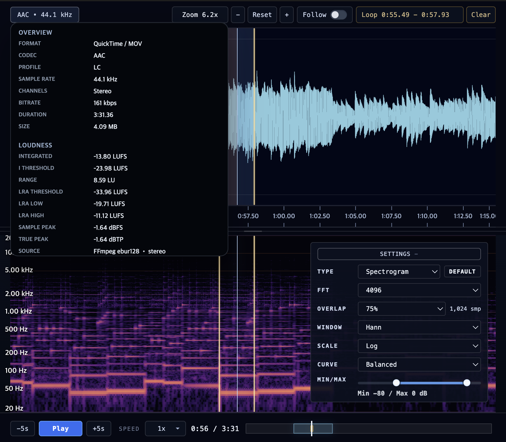

# audioscope

<p align="center">
  
</p>

<p align="center">
  <strong>Inspect audio files in VS Code with synchronized waveform, spectrogram, playback, and loudness views.</strong>
</p>

<p align="center">
  Open a supported audio file and explore timing, frequency content, loop ranges, metadata, and loudness without leaving the editor.
</p>

<p align="center">
  
</p>

## Overview

audioscope is a custom read-only audio viewer for VS Code. It is built for quick inspection and analysis rather than editing, so you can stay inside your workspace while reviewing audio assets, recordings, stems, or exports.

| See | Control | Review |
| --- | --- | --- |
| Waveform and spectrogram side by side | Seek, zoom, pan, follow playback, and loop sections | Metadata, LUFS/LRA, sample peak, and true peak summary |

## Highlights

- Open common audio formats in a dedicated VS Code view
- View waveform and spectrogram together in a fullscreen-first, resizable layout
- Click to seek, drag to create loop ranges, and refine loop points with direct handles
- Use follow mode, overview scrolling, zoom controls, and variable playback speed for long recordings
- Tune spectrogram type, FFT size, overlap, and frequency scale from the editor UI
- Review codec, container, duration, bitrate, and channel metadata
- Inspect integrated loudness, loudness range, sample peak, and true peak at a glance
- Use bundled FFmpeg WebAssembly tools for metadata and decode fallback

## Quick Start

1. Install the extension.
2. Open a supported audio file in VS Code.
3. If VS Code selects `audioscope`, the file opens directly in the custom view.
4. If it opens somewhere else, use `Reopen Editor With...` or run `audioscope: Open Active Audio File in audioscope` from the Command Palette.

> [!NOTE]
> VS Code's built-in `Media Preview` currently takes precedence for `.mp3`, `.wav`, `.ogg`, and `.oga`, so those formats may not open in `audioscope` automatically on first install.

To make audioscope the default editor for those formats, use `Reopen Editor With...` and choose `Set as Default`, or add this to your VS Code settings:

```json
{
  "workbench.editorAssociations": {
    "*.mp3": "audioscope.editor",
    "*.wav": "audioscope.editor",
    "*.ogg": "audioscope.editor",
    "*.oga": "audioscope.editor"
  }
}
```

## Supported Formats

audioscope contributes a custom editor for:

- `.wav`
- `.wave`
- `.mp3`
- `.ogg`
- `.oga`
- `.flac`
- `.m4a`
- `.aac`
- `.opus`
- `.aif`
- `.aiff`

## Controls

- `Space`: play or pause
- `Left Arrow` / `Right Arrow`: seek backward or forward by 5 seconds
- `F` / `f`: toggle follow playback
- `-` / `=`: zoom out or zoom in
- Playback speed menu: switch from `0.5x` to `2x`
- Click on the waveform or spectrogram: seek to that point
- Drag on the waveform or spectrogram: create a loop range
- Drag loop handles: adjust loop boundaries
- Mouse wheel or trackpad: zoom or pan the visible range
- Drag the center splitter: resize waveform and spectrogram panels
- Spectrogram controls: choose `Spectrogram`, `Mel-Spectrogram`, or `Scalogram`, then adjust FFT, overlap, and frequency scale

## Embedded ffmpeg Tools

audioscope now bundles embedded FFmpeg WebAssembly tools for:

- richer metadata via embedded `ffprobe`
- decode fallback for files the runtime cannot open directly
- probing files even when the webview cannot decode them natively

audioscope no longer depends on a system `ffmpeg` or `ffprobe` install at runtime.

For the bundled FFmpeg revision and rebuild notes used by the embedded media tools, see [FFMPEG_SOURCE.md](./FFMPEG_SOURCE.md).

## Requirements

- VS Code `1.100.0` or later
- Runtime use does not require a system `ffmpeg` or `ffprobe`
- Building from source requires `bun`, `zig` `0.15+`, and an Emscripten toolchain (`emcc`, `emconfigure`, `emmake`)
- The embedded media tool build can resolve Emscripten from `PATH`, `EMSCRIPTEN_ROOT`, `EMSDK`, or common Homebrew/emSDK install locations

## Settings

- `audioscope.spectrogramQuality`: choose `balanced`, `high`, or `max`
- `audioscope.openSampleOnStartupInDevelopment`: open the bundled sample file automatically in development mode

## Notes

- Very long, high-sample-rate, or multichannel files can use substantial memory while audioscope decodes audio and prepares waveform and spectrogram analysis.
- Loudness values are measured with the bundled FFmpeg `ebur128` analysis path and preserve the source channel layout when available.

## Development

```bash
bun install
git submodule update --init --recursive
bun run compile
```

`bun run compile` requires `bun`, `zig` `0.15+`, and Emscripten. It produces:

- `dist/webview/` webview bundles
- `dist/wasm/wasm_core_simd.wasm`
- `dist/wasm/wasm_core_fallback.wasm`
- `dist/embedded-tools/` embedded `ffmpeg` / `ffprobe` WebAssembly artifacts and manifest

Open this folder in VS Code and press `F5` to launch the Extension Development Host.

In development mode, `exampleFiles/sample-tone.wav` opens automatically in `audioscope`, and the performance timeline panel is visible for debugging. To disable the sample-open behavior, set `audioscope.openSampleOnStartupInDevelopment` to `false`.

## Release

Before publishing a VSIX, run:

```bash
bun run compile
npx @vscode/vsce package
```

## Acknowledgements

- Scalogram optimization was informed by the public implementation and documentation of [`fCWT`](https://github.com/fastlib/fCWT), especially around precomputed scale-to-frequency mappings, wavelet kernel reuse, and vectorization-friendly computation structure.
- audioscope does not embed or depend on `fCWT` directly at runtime.
