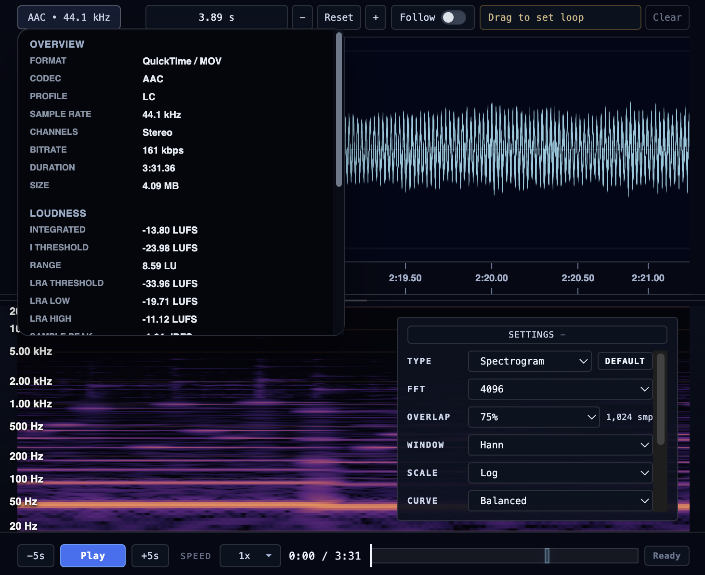
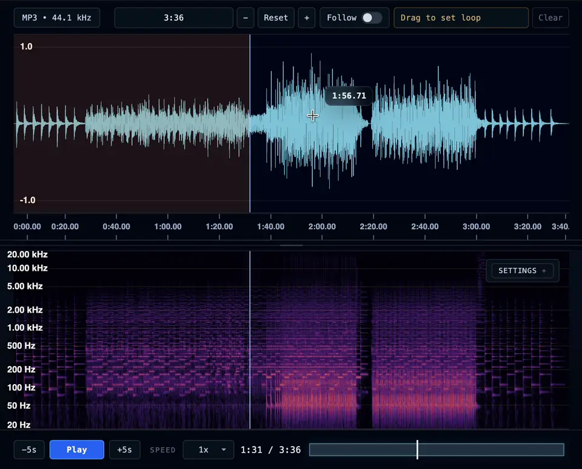
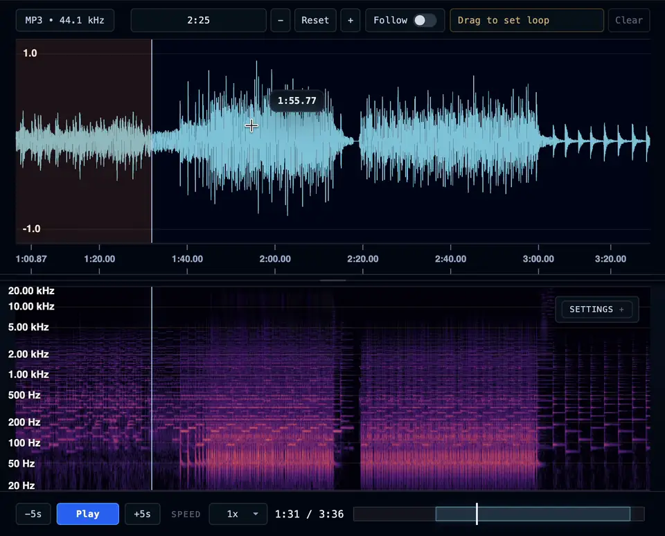
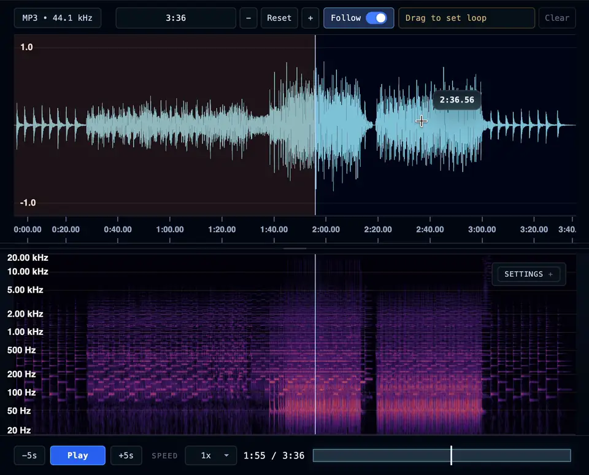
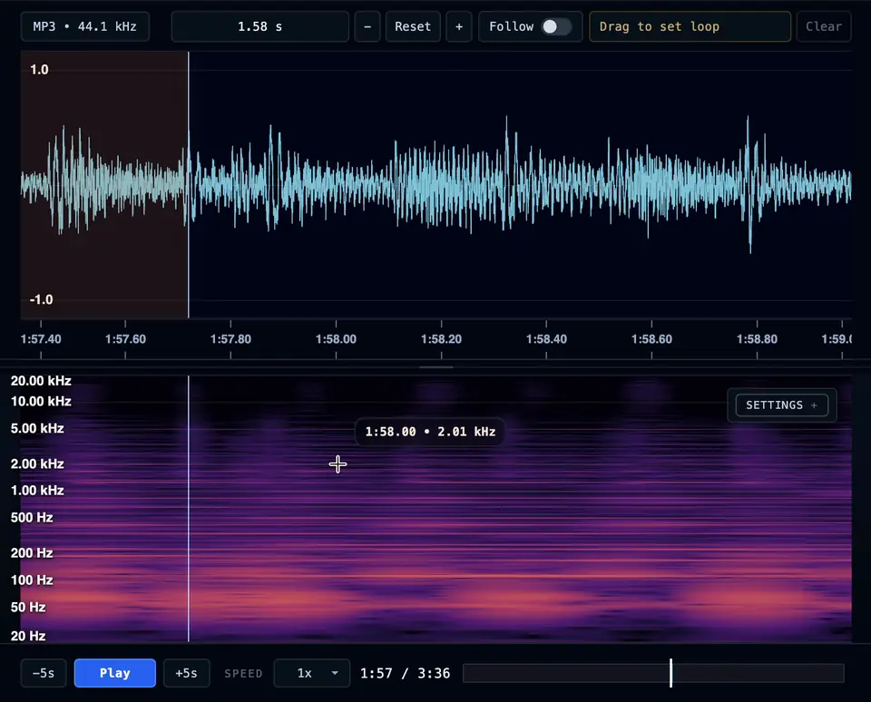
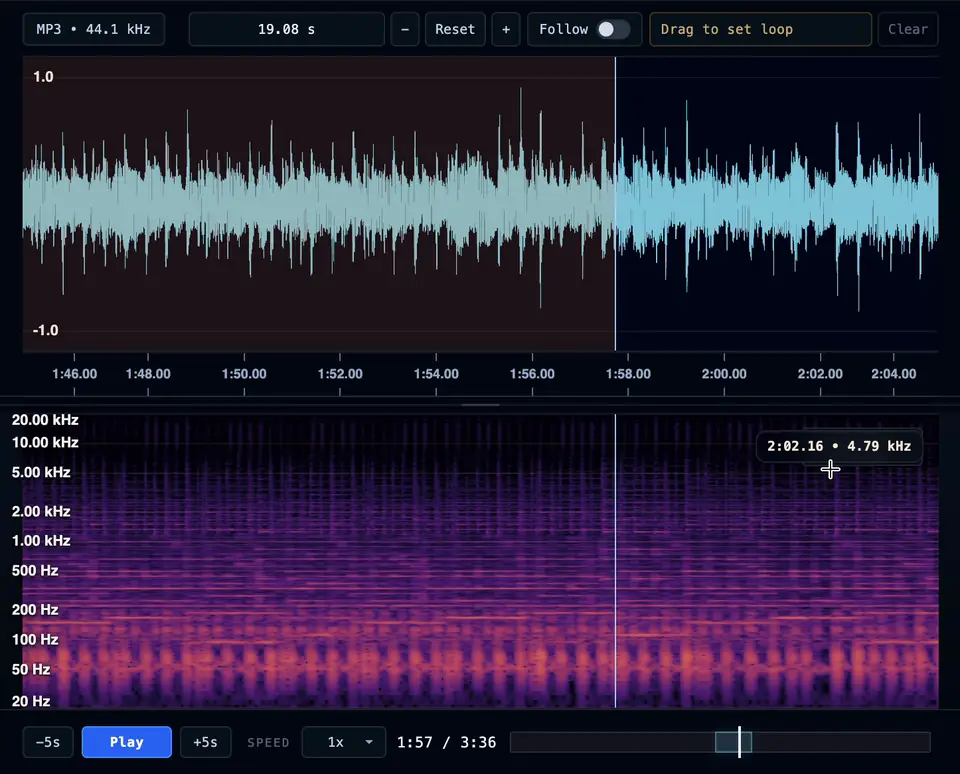
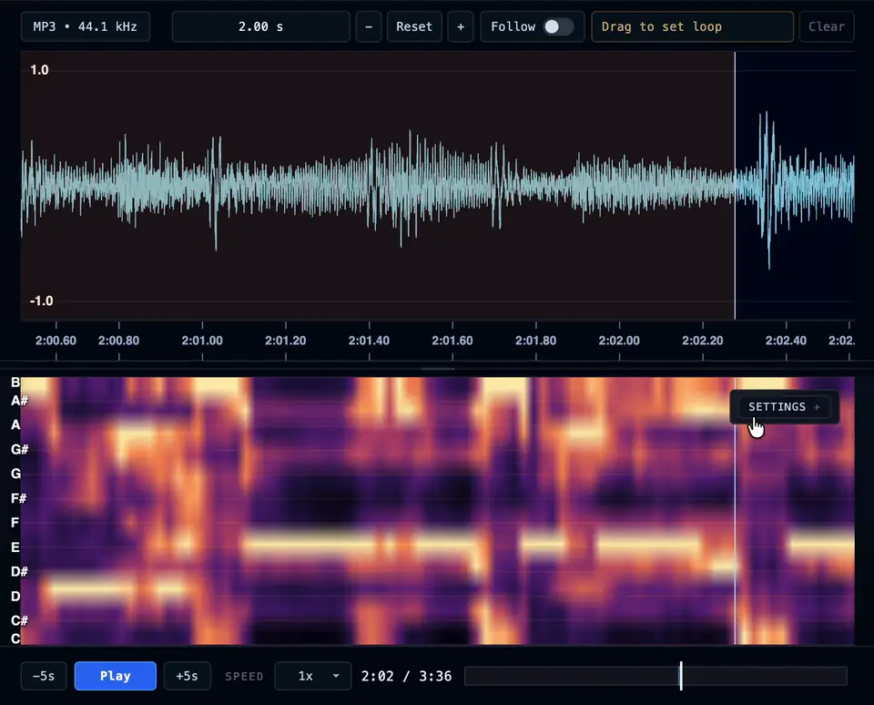

# audioscope

<p align="center">
  
</p>

<p align="center">
  <strong>Audio inspector for waveform, spectrogram, playback, loop selection, loudness, and metadata review.</strong>
</p>

<p align="center">
  
</p>

**Sample-level inspection** — keep zooming until individual samples appear as dots; hovering shows the sample index and per-channel amplitude values.



**Follow playback** — with Follow enabled, the view auto-scrolls to keep the playhead centered at any zoom level, down to sample resolution.



**Loop selection** — drag on the waveform to set a loop range and fine-tune it with the edge handles while playback cycles inside.



**Spectrogram inspection** — hover to read the exact time and frequency under the cursor; the spectrogram stays in sync with the waveform zoom.



**Analysis type and settings** — switch the analysis type (here, to mel-spectrogram) and tune FFT size, overlap, window function, and frequency scale from the settings panel.



**Loudness view** — momentary and short-term LUFS curves plotted against a reference level, with hover readouts for M/S loudness and sample peak.



## Quick Start

`audioscope` is a read-only custom editor for audio files inside VS Code.

1. Install the extension.
2. Open a supported audio file.
3. If needed, right-click the file and choose **Open in audioscope**, or run **`audioscope: Open in audioscope`**.

> [!NOTE]
> VS Code `Media Preview` can still take precedence for some extensions on first open, especially `.mp3`, `.wav`, and `.ogg` files.

## Supported Formats

`.wav`, `.wave`, `.mp3`, `.ogg`, `.oga`, `.flac`, `.m4a`, `.aac`, `.opus`, `.aif`, `.aiff`

## Features

### Waveform and transport

- Synchronized waveform viewer
- Timeline scrubber and overview strip
- Play / pause controls
- Seek backward and forward by 5 seconds
- Playback speed control
- Follow playback mode
- Loop selection and loop handles
- Waveform zoom controls

### Spectrogram and analysis

- Spectrogram visualization
- Audio analysis uses WebGPU when available, with WASM fallback for unsupported environments
- Spectrogram, mel-spectrogram, MFCC, scalogram, and chroma analysis are computed from a mono downmix of the source audio
- FFT size controls
- Overlap ratio controls
- Window function selection
- Frequency scale controls
- Colormap distribution controls
- Decibel range controls
- Mel band count controls
- MFCC coefficient controls
- Scalogram omega0 control

### Metadata and loudness

- Audio metadata summary
- Codec name and long name
- Container / format information
- Duration, size, bitrate, sample rate, and channel layout
- Tags and chapter data
- Loudness analysis with LUFS, LRA, Peak, and True Peak
- FFmpeg / ffprobe tool status and fallback guidance

## Settings

- `audioscope.spectrogramQuality`: `balanced | high | max`
- `audioscope.spectrogramDefaults`: persisted defaults for analysis controls, including advanced scalogram defaults when edited in settings JSON
- `audioscope.openSampleOnStartupInDevelopment`: open the bundled sample on startup in development mode

## Keywords

audio inspector, waveform, spectrogram, mel, mfcc, scalogram, chroma, playback, loop, metadata, loudness, LUFS, integrated LUFS, EBU R 128, LRA, mp3, wav, flac, m4a, ogg, aac, opus, aiff, aif

## Development

Build prerequisites:

- `bun`
- `zig` `0.15+`
- Emscripten toolchain
- FFmpeg submodule checkout

Build from source:

```bash
bun install
git submodule update --init --recursive
bun run compile
```

The full build compiles:

- embedded FFmpeg / ffprobe WASM tools
- analysis WASM binaries
- webview bundles
- extension host output

## Third-Party And Vendor Code

This repository includes vendored and third-party source.

- `src-wasm/third_party/ffmpeg`
  The FFmpeg source tree vendored as a submodule and used to build the
  embedded FFmpeg / ffprobe WebAssembly binaries.
  Upstream repository: <https://github.com/FFmpeg/FFmpeg>
- `src-wasm/third_party/pffft`
  PFFFT and FFTPACK-based FFT code used by the analysis WASM runtime.
  Original PFFFT repository: <https://bitbucket.org/jpommier/pffft/>
- `src-webview/vendor/SignalsmithStretch.mjs`
  Vendored Signalsmith Stretch Web module used for time-stretch playback in the
  webview transport path.
  Official upstream: <https://signalsmith-audio.co.uk/code/stretch.git>
  GitHub mirror: <https://github.com/Signalsmith-Audio/signalsmith-stretch>

Licensing and attribution details for bundled third-party code are documented
in [THIRD_PARTY_NOTICES.md](./THIRD_PARTY_NOTICES.md). FFmpeg rebuild notes and
revision details are documented in [FFMPEG_SOURCE.md](./FFMPEG_SOURCE.md).

## License

MIT
