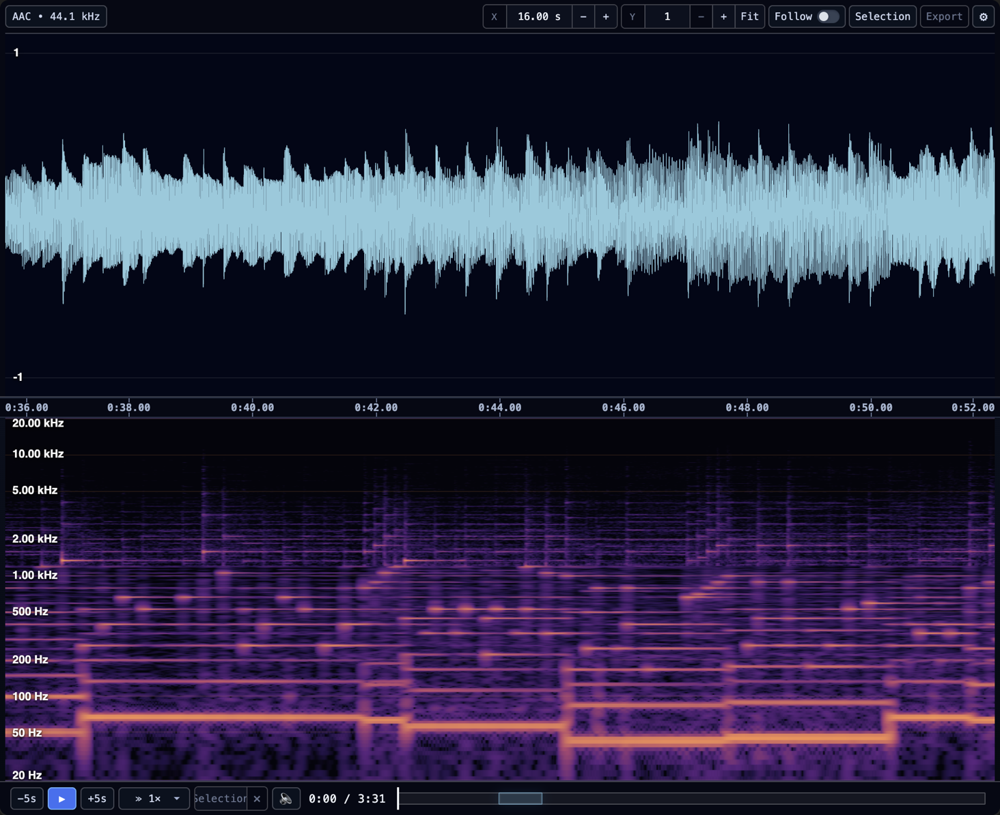
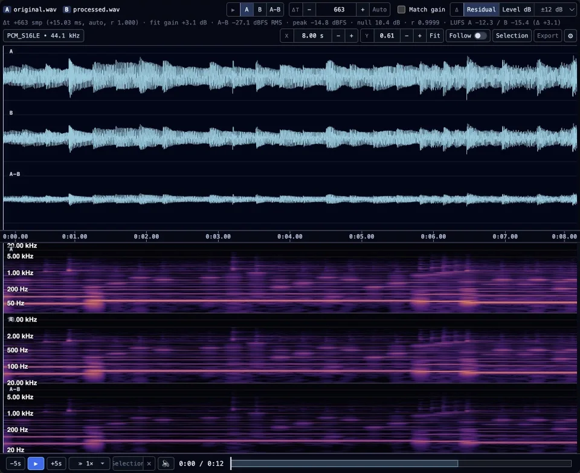
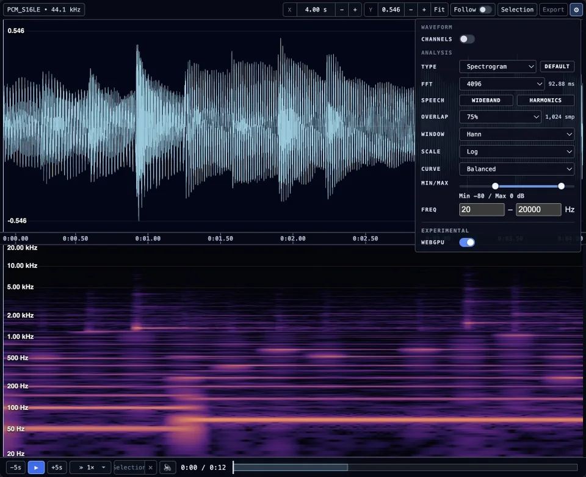
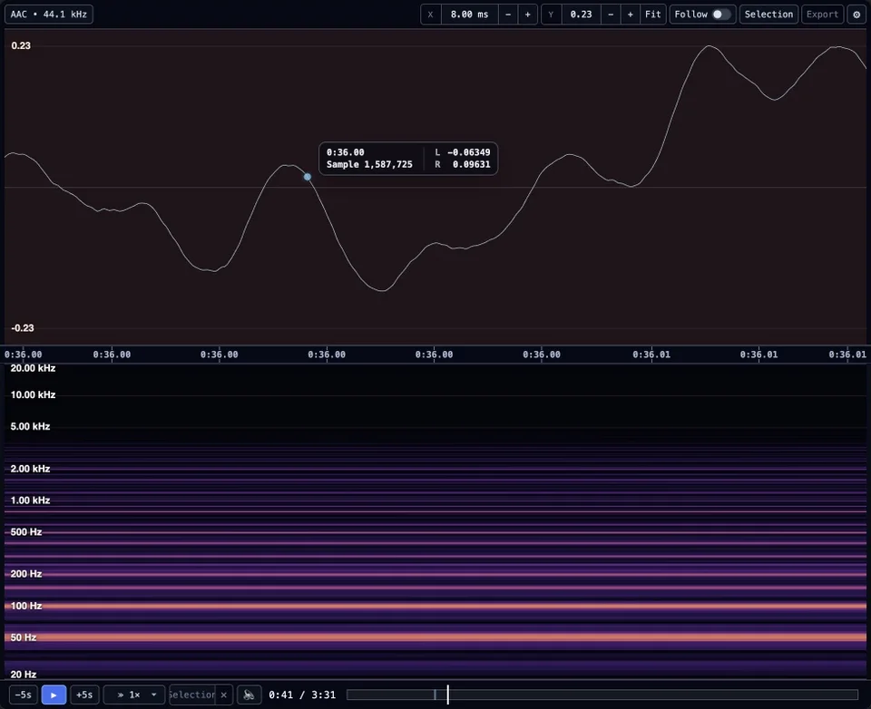
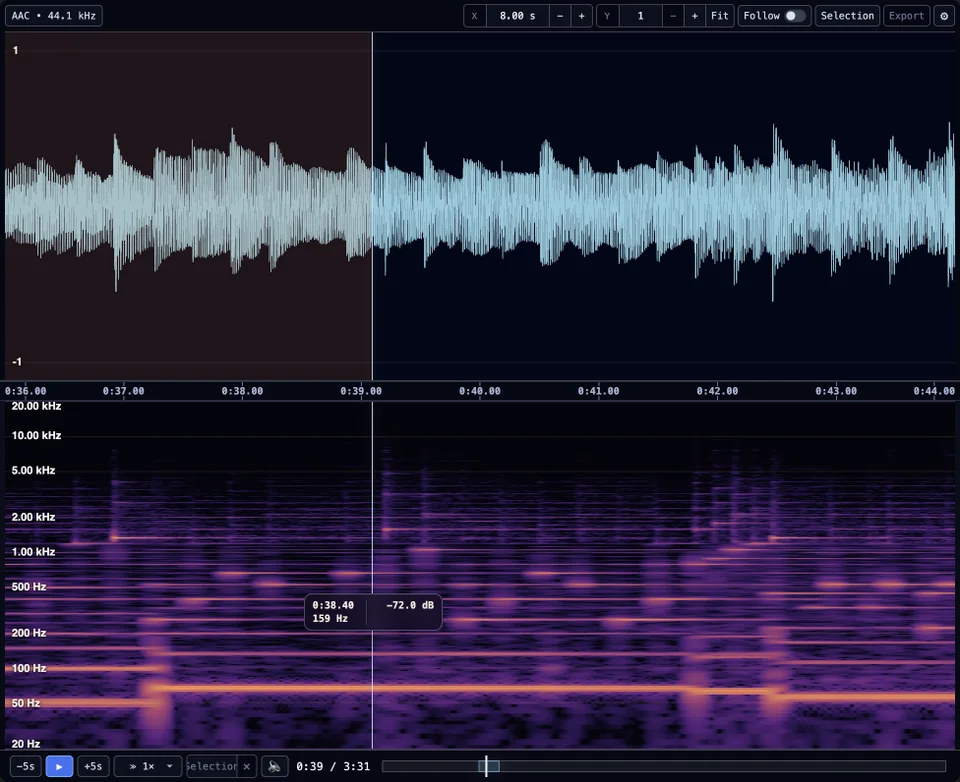
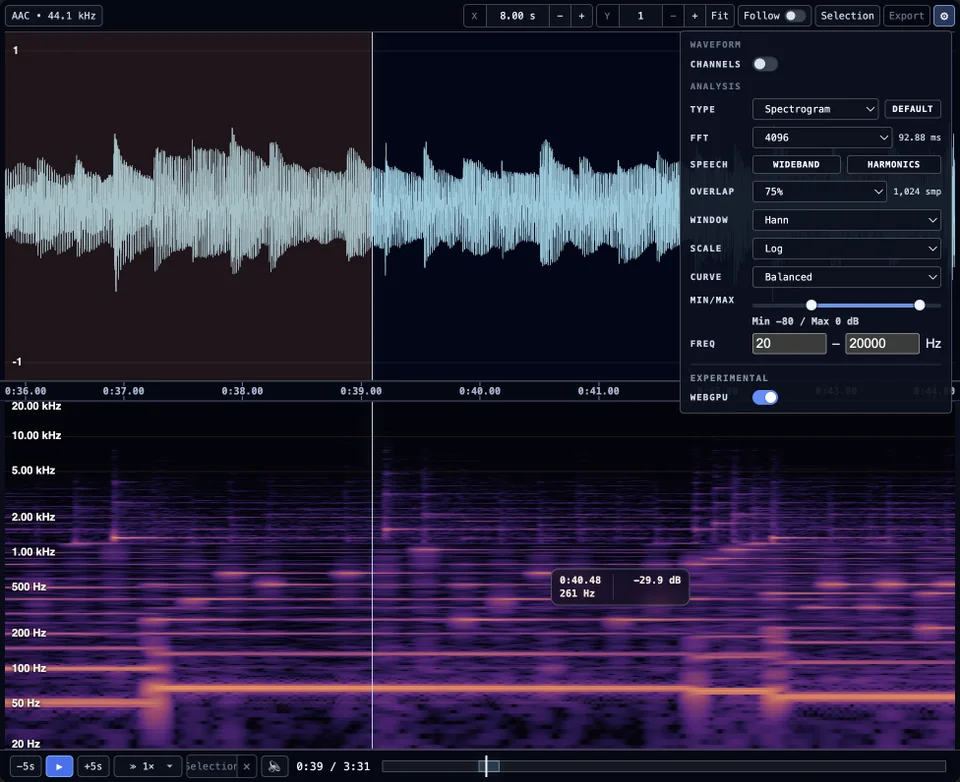
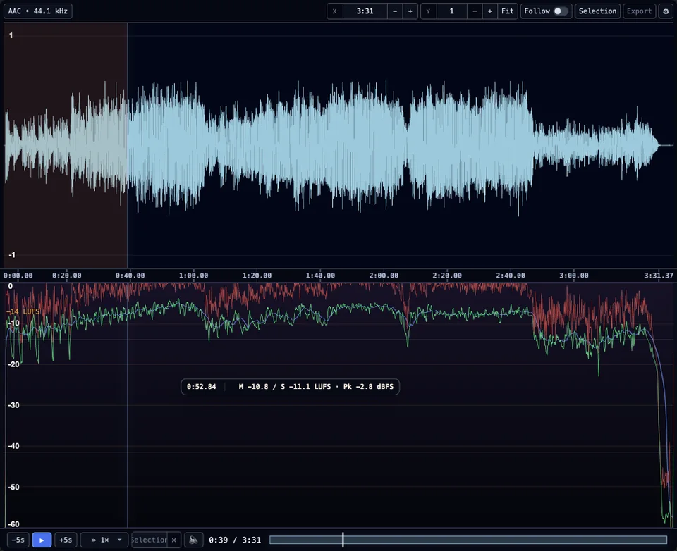
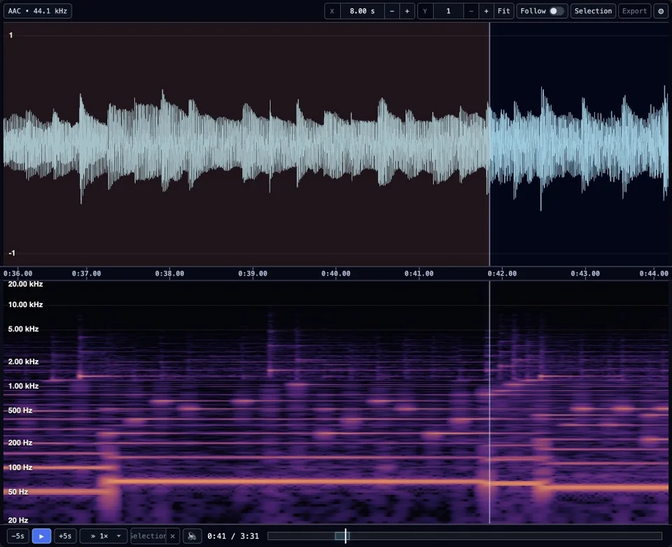
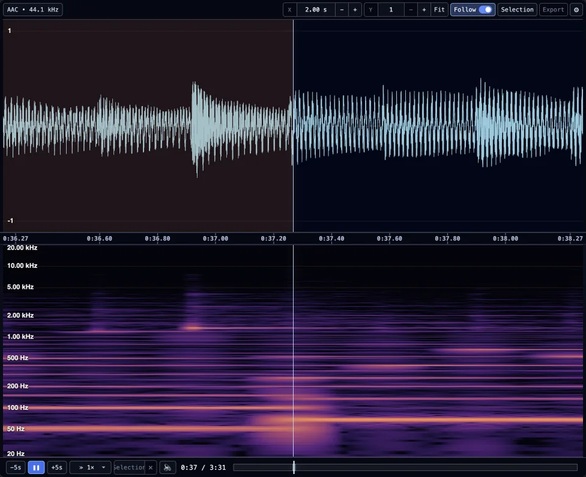

# audioscope

<p align="center">
  
</p>

<p align="center">
  <strong>Inspect, play, and compare audio inside VS Code.</strong>
</p>

<p align="center">
  
</p>

## Features

**Compare files** — align A/B audio, match gain, and switch between the originals, A − B residual, and spectral level differences.



**Channel views** — switch from the mono downmix to separate channel waveforms and spectrograms.



**Sample inspection** — zoom into individual samples and read per-channel amplitudes.



**Spectrogram** — inspect time and frequency with synchronized zoom and hover readouts.



**Analysis views** — switch between spectrogram, mel, MFCC, scalogram, and chroma; tune the analysis settings.



**Loudness** — view momentary and short-term LUFS curves, plus integrated loudness, LRA, peak, and true peak.



**Loop selection** — select a range, adjust its edges, and repeat it.



**Follow playback** — keep the playhead in view as the audio plays.



- **Selection analysis:** inspect spectrum, peak, RMS, DC offset, clipping ratio, crest factor, zero-crossing rate, dominant frequency, and spectral centroid; copy measurements or spectrum data as CSV. WASM computes time-domain statistics in one pass over every selected sample and reuses the spectrogram's FFT resources for spectral estimates from up to 64 evenly spaced windows.
- **Audio paths in text:** hover a path in a manifest, log, or source file and choose **Open in audioscope**, or run **audioscope: Open Audio Path at Cursor**. Supports quoted paths with spaces, JSON-escaped paths, absolute paths, and paths relative to the text file or workspace folders, including Remote SSH.
- **Export:** save a selection or the whole file as WAV, MP3, M4A, or FLAC.
- **Playback:** adjust speed, volume, and waveform amplitude; seek and zoom to a selection.
- **Metadata:** inspect codec, format, tags, and chapters with chapter navigation.
- **Acceleration:** automatically use WebGPU analysis when available, with CPU/WASM fallback.
- **Media backend:** bundled native tools accelerate metadata and exporting when
  compatible. Decoding and codec loudness use the established WASM path by default.
  Native decoding is available through the experimental `audioscope.nativeDecoding`
  setting (reload the window after changing it). Failed native operations use WASM.
  Remote playback transfers compressed audio and decodes in the webview to avoid
  sending large PCM buffers over the connection. Analysis WASM and WebGPU are unchanged.

## Quick Start

1. Install the extension and open an audio file.
2. If needed, right-click the file and choose **Open in audioscope**.
3. To compare, select two audio files in the Explorer and choose **Compare Audio Files…**. B is automatically aligned to A using FFT cross-correlation within ±2 seconds, then refined to the nearest sample. Adjust the sample offset manually if needed, or choose **Auto align** to restore the estimate. Silent or constant signals keep a zero automatic offset.

The editor is read-only. VS Code Media Preview may take precedence on first open.

**Supported formats:** WAV, MP3, OGG, FLAC, M4A, AAC, Opus, and AIFF.

## Settings

Open VS Code Settings and search for `audioscope` to adjust analysis quality, defaults, and channel views. Playback volume, waveform amplitude, and the panel split are saved automatically.

Text-path navigation can be disabled with `audioscope.audioPathNavigation.enabled`. Only the hovered line is parsed (up to 20,000 characters); files are checked when you open the path.

## Development

Build prerequisites:

- `bun`
- `zig` `0.15+`
- Emscripten toolchain
- FFmpeg submodule checkout
- A native C compiler, `make`, `pkg-config`, and a POSIX shell
  (MSYS2/MinGW on Windows; x86 builds also need an assembler such as NASM)

Build from source:

```bash
bun install
git submodule update --init --recursive
bun run compile
```

The full build compiles:

- embedded FFmpeg / ffprobe WASM tools
- native audio tools for the build machine's OS and architecture
- analysis WASM binaries
- webview bundles
- extension host output

Native artifacts persist in `.artifacts/native-tools/<platform>-<arch>/`; the
native build also copies the current target into `dist/native-tools/` for local
development. macOS binaries target 12.0. Linux packages record the glibc version
they require; older glibc and musl environments keep using WASM.

Package verified runtime files without rebuilding or deleting native artifacts:

```bash
bun run package:release darwin-arm64
bun run package:release universal
```

The universal package is WASM-only. Platform packages contain exactly one native
target. `.github/workflows/release-readiness.yml` builds and tests all six x64/ARM64
targets for macOS, Linux, and Windows, plus the universal fallback package.
Packages are saved in `.artifacts/release/`.

Test an installed VSIX in an isolated VS Code profile:

```bash
bun run test:vsix .artifacts/release/audioscope-1.1.9-darwin-arm64.vsix
```

This opens the real editor, verifies rendered waveform and audio signal, exports
WAV/MP3/M4A/FLAC through the UI, and checks the native option and WASM fallback.
It uses isolated settings and extension directories and does not change the
user's installed extension.

Run the reproducible native/WASM comparison after compiling:

```bash
bun run benchmark:native-audio
```

The benchmark validates PCM and loudness agreement, alternates backend order,
and reports five-run medians for decoding, decoding plus loudness, metadata, and
WAV/MP3 selection exports. Results and raw timings are saved as JSON and CSV
under `benchmarks/native-audio/`. Times include host-side PCM delivery and exclude
webview rendering. The WASM pool is warmed; native requests start new processes.

### Native backend measurements

Measured on 2026-10-05 with an Apple M4 Pro, 48 GiB RAM, Node 22.23.0, five
alternating runs, and native decoder threading set to automatic (codec-dependent).
Values below are median milliseconds, **native / WASM**. Exports select 15 seconds.

| Input | Decode | Decode + LUFS | Metadata | WAV export | MP3 export |
| --- | ---: | ---: | ---: | ---: | ---: |
| MP3, 216 s | 158.1 / 171.8 | 987.5 / 874.6 | 6.2 / 40.6 | 20.4 / 77.8 | 116.4 / 202.3 |
| AAC, 211 s | 160.9 / 161.7 | 1067.5 / 1047.0 | 7.3 / 54.4 | 22.0 / 103.2 | 137.5 / 348.9 |
| FLAC, 120 s | 120.1 / 224.4 | 685.5 / 695.0 | 6.8 / 47.3 | 26.1 / 115.6 | 143.3 / 359.5 |
| WAV, 120 s | 40.4 / 18.2 | 526.1 / 515.7 | 10.1 / 53.0 | 13.2 / 77.0 | 132.2 / 279.9 |

Native metadata and export improve consistently in these fixtures. Decoding and
loudness depend on the codec, which is why the native decoder remains optional.
These are host operation timings including I/O and PCM delivery, excluding editor
rendering; they are not full VS Code end-to-end timings or guarantees for other CPUs.

## Third-Party And Vendor Code

This repository includes vendored and third-party source.

- `src-wasm/third_party/ffmpeg`
  The FFmpeg source tree vendored as a submodule and used to build the
  embedded native and WebAssembly media tools.
  Upstream repository: <https://github.com/FFmpeg/FFmpeg>
- `src-wasm/third_party/pffft`
  PFFFT and FFTPACK-based FFT code used by the analysis WASM runtime.
  Original PFFFT repository: <https://bitbucket.org/jpommier/pffft/>
- `src-webview/vendor/SignalsmithStretch.mjs`
  Vendored Signalsmith Stretch Web module used for time-stretch playback in the
  webview transport path.
  Official upstream: <https://signalsmith-audio.co.uk/code/stretch.git>
  GitHub mirror: <https://github.com/Signalsmith-Audio/signalsmith-stretch>

Licensing and attribution details for bundled third-party code are documented
in [THIRD_PARTY_NOTICES.md](./THIRD_PARTY_NOTICES.md). FFmpeg rebuild notes and
revision details are documented in [FFMPEG_SOURCE.md](./FFMPEG_SOURCE.md).

## License

MIT
